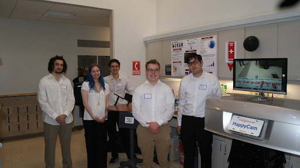

# 📷 HappyCam – Wireless Backup Camera Cleaner

  

## ✨ Overview
For my Entrepreneurship, Innovation, and Invention class, my team and I created HappyCam. HappyCam is an independent, user-installable **backup camera cleaning device** designed to reduce accidents caused by dirty rear-view cameras. This was a group project aimed at developing a marketable consumer product that blends mechanical design, electronics integration, and strategic business planning. The final product mounts behind a vehicle’s license plate and sprays washer fluid onto the backup camera at the press of a button—no hardwiring or car modifications needed.

My role in this project was twofold: I acted as the **Chief Financial Officer (CFO)** and also contributed to the **engineering prototyping and electronics testing**. As CFO, I led our financial modeling, cost evaluation, and market research. On the engineering side, I helped with CAD work for our early prototypes, pump system testing, and validation of the wireless pump activation circuit using Arduino.

---

## 👨‍💻 Personal Contributions

- **📊 Financial Strategy & Business Modeling**  
  - Developed a comprehensive **market analysis**, identifying over 63.7M potential U.S. customers and refining our **serviceable obtainable market** to ~65K based on realistic adoption rates.
  - Created a **5-year revenue projection** leading to a forecast of $16.8M in sales by year five.
  - Conducted cost breakdowns for **fixed**, **variable**, and **direct** manufacturing costs, including pricing analysis for injection molding, shipping, warranty coverage, and commission.
  - Calculated our **break-even point** (5,429 units sold) and formulated our **fundraising pitch** for $150K in seed funding in exchange for 8% equity.

- **💻 Arduino Testing & Circuit Integration**  
  - Assisted in the **testing of radio-based communication** using Arduino Nano and nRF24L01+ modules to trigger the water pump remotely via a button press.
  - Helped with system testing to validate signal transmission, pump activation timing, and battery behavior under cold weather conditions.

- **🔧 Mechanical Design & Pump System Testing**  
  - Collaborated on early-stage **CAD sketches and housing layouts** using Onshape to define the internal structure for electronics, tank, and battery compartments.
  - Participated in testing the **pump-tank-nozzle system**, ensuring correct alignment, fluid delivery rate, and pressure consistency for cleaning the camera lens.

---

## 🛠 Tools & Technologies
- **Onshape** – Used to help draft CAD housing outlines and nozzle/tank assembly components.
- **Arduino Nano** – Microcontroller used to test the pump activation and wireless communication system.
- **Arduino IDE** – IDE used to test and debug Arduino code and radio communication circuits.
- **Excel / Google Sheets** – Used for financial modeling and projecting production costs, break-even analysis, and ROI for investors.

---

## 🧠 Engineering Summary
> The HappyCam system features a self-contained circuit, 9V lithium batteries for off-grid operation, a 6–12V water pump, and a radio receiver. The prototype has been tested for weather-resilience, usage lifespan (~2.5 months), and camera spray efficiency. Though I didn’t directly build the full circuit, I helped validate its operation and contributed to its design testing.

---

## 📬 Contact
Reach out at dawi5869@colorado.edu
